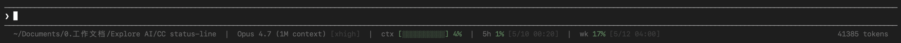

# Claude Code Statusline

一个为 [Claude Code](https://docs.claude.com/en/docs/claude-code) 设计的自定义状态栏，显示工作目录、Git 状态、模型、上下文用量、5 小时 / 7 天 rate limit。



## 字段说明

```
cwd (git) [wt]  |  model [effort]  |  ctx [bar] X%  |  5h X% [reset]  |  wk X% [reset]
```

| 字段 | 含义 |
|---|---|
| `cwd` | 当前工作目录（`$HOME` 替换为 `~`） |
| `(branch ●⇡⇣)` | Git 分支与状态：`●` 未暂存改动、`+` 已暂存、`!` 冲突、`⇡N` ahead、`⇣N` behind |
| `[wt]` | 在 `git worktree add` 出来的 worktree 内时显示 |
| `model [effort]` | 当前模型 + `~/.claude/settings.json` 中 `effortLevel` 默认档位 |
| `ctx [bar] X%` | 上下文窗口用量，10 格视觉条 + 整数百分比 |
| `5h X% [reset]` | 5 小时窗口 rate limit 用量与重置时间 |
| `wk X% [reset]` | 7 天窗口 rate limit 用量与重置时间 |

颜色阈值：< 50% 苔藓绿；50–80% 暗琥珀；≥ 80% 砖红。整体采用 256 色暗色调色板，避免视觉刺激。

## 一键安装

### macOS

```bash
curl -fsSL https://raw.githubusercontent.com/ZeyuSi-2099/claude-code-statusline/main/install.sh | bash
```

> 不放心 `curl | bash`？先[读源码](install.sh)再决定。

安装脚本做了什么：

1. 检查依赖 `bash` / `jq` / `git` / `curl`
2. 把 `statusline.sh` 写到 `~/.claude/statusline.sh`，并赋予执行权限
3. 修改 `~/.claude/settings.json` 的 `statusLine.command` 字段
4. 如果你已经有自定义的 statusline，原文件会备份为 `statusline.sh.bak.<timestamp>`，且 `settings.json` 中已有的非默认配置**不会被覆盖**

### Windows

在 PowerShell（5.1 或 7+ 都行，无需 Git Bash / WSL）中执行：

```powershell
iwr -useb https://raw.githubusercontent.com/ZeyuSi-2099/claude-code-statusline/main/install.ps1 | iex
```

> 不放心？先[读源码](install.ps1)再决定。

安装脚本做了什么：

1. 检查依赖 `git`（`jq` / `curl` 由 PowerShell 内置 `ConvertFrom-Json` / `Invoke-WebRequest` 替代）
2. 把 `statusline.ps1` 写到 `%USERPROFILE%\.claude\statusline.ps1`
3. 把 `%USERPROFILE%\.claude\settings.json` 的 `statusLine.command` 设为 `powershell.exe -NoProfile -ExecutionPolicy Bypass -File "<绝对路径>"`
4. 已存在的 `statusline.ps1` 会备份为 `statusline.ps1.bak.<timestamp>`；`settings.json` 中已有的非默认 `statusLine` 配置**不会被覆盖**

> 注：`settings.json` 里写的是安装时解析后的绝对路径，所以重命名或移动 `~/.claude` 后需要重跑安装。

安装完成后**重启 Claude Code** 状态栏即生效。

## 平台支持

**macOS / Windows。** macOS 用 `statusline.sh` + `install.sh`（BSD `date -r`）；Windows 用 `statusline.ps1` + `install.ps1`（原生 PowerShell，无需 Git Bash / WSL）。Linux 暂未原生支持，欢迎 PR。

## 卸载

### macOS

```bash
rm ~/.claude/statusline.sh
# 然后手动从 ~/.claude/settings.json 中移除 "statusLine" 字段
```

### Windows

```powershell
Remove-Item "$env:USERPROFILE\.claude\statusline.ps1"
# 然后手动从 %USERPROFILE%\.claude\settings.json 中移除 "statusLine" 字段
```

## License

MIT
